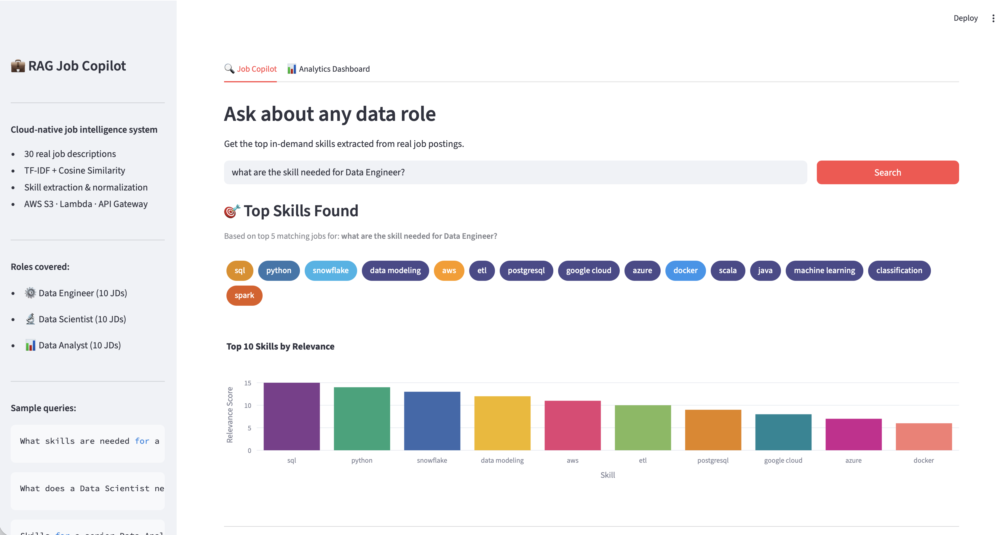
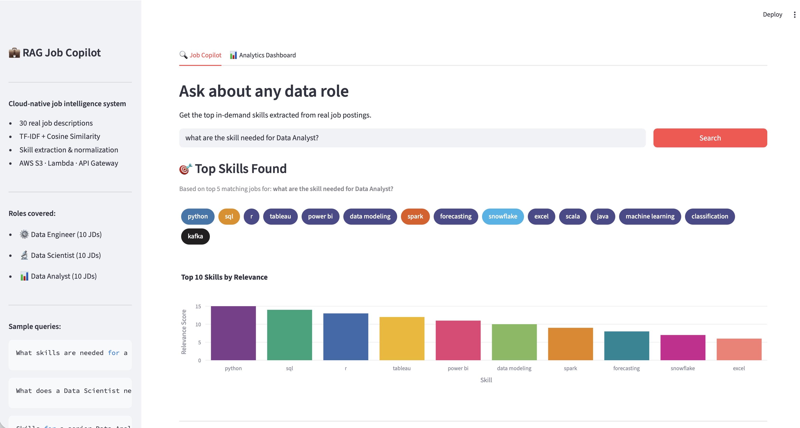
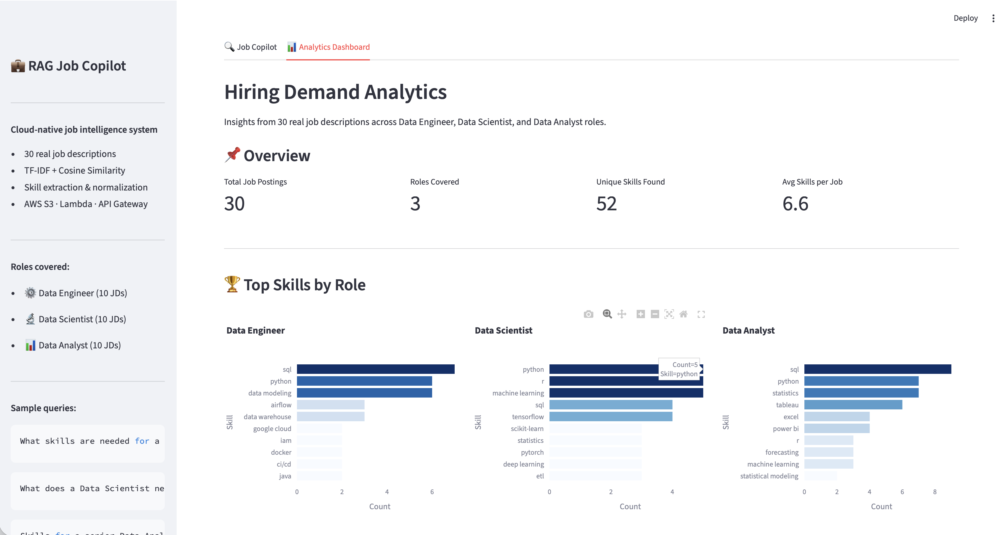

# 💼 RAG Job Copilot

A cloud-native job intelligence system that analyzes real job descriptions to surface in-demand skills and role insights — built with AWS Lambda, S3, API Gateway, and Streamlit.

> IST 615 Final Project · Spring 2026 · Prasad Pramod Patil & Darsh Yogesh Thakor

---

## Screenshots

**Job Copilot — Data Engineer query**


**Job Copilot — Data Analyst query**


**Analytics Dashboard**


---

## Overview

Job seekers often struggle to identify which skills are truly in demand without manually reading dozens of postings. RAG Job Copilot solves this by implementing a **Retrieval-Augmented Generation (RAG)** pipeline over 30 real job descriptions across three data roles, delivering structured skill insights through a natural-language query interface.

---

## Architecture

```
User (Streamlit UI)
      │
      ▼
AWS API Gateway  ──►  AWS Lambda (Python)  ──►  Amazon S3
                           │                     (job .txt files)
                           │
                     TF-IDF + Cosine Similarity
                     Skill Extraction & Normalization
                           │
                           ▼
                     Structured JSON Response
                     (top skills + matching jobs)
```

| Layer      | Technology                        |
|------------|-----------------------------------|
| Frontend   | Streamlit                         |
| API        | AWS API Gateway (REST)            |
| Processing | AWS Lambda (Python 3.11)          |
| Storage    | Amazon S3                         |
| NLP        | scikit-learn (TF-IDF, cosine sim) |
| Analytics  | Plotly, pandas                    |

---

## How It Works

1. **Retrieve** — User submits a natural language query (e.g. *"What skills does a Data Engineer need?"*)
2. **Extract** — Lambda loads 30 `.txt` job descriptions from S3, vectorizes them with TF-IDF, and ranks by cosine similarity to the query
3. **Generate** — Top 5 matching jobs are returned with extracted/normalized skills and metadata

### Skill Normalization
Variant forms are unified to canonical names before matching:

| Input | Normalized |
|-------|-----------|
| `pyspark`, `apache spark` | `spark` |
| `postgres` | `postgresql` |
| `nlp` | `natural language processing` |
| `k8s` | `kubernetes` |
| `cicd`, `github actions` | `ci/cd` |

---

## Dataset

- **30 job descriptions** stored as `.txt` files in S3
- **3 roles**: Data Engineer (10), Data Scientist (10), Data Analyst (10)
- **52 unique skills** extracted · **6.6 avg skills per job**
- Files are named `de_*.txt`, `ds_*.txt`, `da_*.txt` for role detection

---

## Project Structure

```
rag-job-copilot/
├── app.py                        # Streamlit frontend
├── lambda_function.py            # AWS Lambda handler (NLP logic)
├── Lambda_Function_Original.ipynb # Colab notebook used to build & deploy Lambda package
└── README.md
```

---

## Local Setup

### Prerequisites
- Python 3.9+
- AWS credentials configured (`~/.aws/credentials` or environment variables)
- Access to the S3 bucket `rag-job-copilot-jds`

### Install dependencies

```bash
pip install streamlit boto3 pandas plotly requests scikit-learn
```

### Run the app

```bash
streamlit run app.py
```

---

## Lambda Deployment

The Lambda function depends on `scikit-learn`, `numpy`, `scipy`, and `joblib`, which exceed Lambda's default size limit. The deployment package was built in Google Colab using `manylinux` wheels:

```bash
pip install scikit-learn==1.3.2 numpy==1.26.4 scipy==1.11.4 joblib==1.3.2 \
  -t lambda_package/ \
  --platform manylinux2014_x86_64 \
  --implementation cp \
  --python-version 3.11 \
  --only-binary=:all: \
  --no-deps
```

See `Lambda_Function_Original.ipynb` for the full build and packaging steps.

**Lambda configuration:**
- Runtime: Python 3.11
- Handler: `lambda_function.lambda_handler`
- Memory: 512 MB recommended
- Timeout: 30 seconds

---

## API

**Endpoint:** `POST /prod/query`

**Request body:**
```json
{ "query": "What skills are needed for a Data Scientist?" }
```

**Response:**
```json
{
  "query": "What skills are needed for a Data Scientist?",
  "top_skills": ["python", "machine learning", "sql", "tensorflow", ...],
  "top_jobs": [
    {
      "title": "Senior Data Scientist",
      "company": "Acme Corp",
      "role": "Data Scientist",
      "seniority": "Senior",
      "score": 0.8412,
      "skills": ["python", "pytorch", "mlflow"],
      "snippet": "..."
    }
  ]
}
```

---

## Features

- **Query-based skill search** — natural language queries over real job data
- **Skill extraction & ranking** — frequency-weighted skill lists from top matching jobs
- **Role & seniority detection** — inferred from filename prefix and job description text
- **Analytics dashboard** — interactive Plotly charts: top skills by role, cross-role overlap, seniority distribution
- **Skill normalization** — aliases and abbreviations unified to canonical names

---

## Future Scope

- Automated data ingestion Lambda to periodically fetch new job postings from external APIs
- Embedding-based retrieval (e.g. sentence-transformers + FAISS) for semantic search
- Expanded role coverage beyond the three current categories
- Resume upload and gap analysis against job requirements

---

## Built With

AWS S3 · AWS Lambda · AWS API Gateway · Streamlit · scikit-learn · Plotly · pandas
